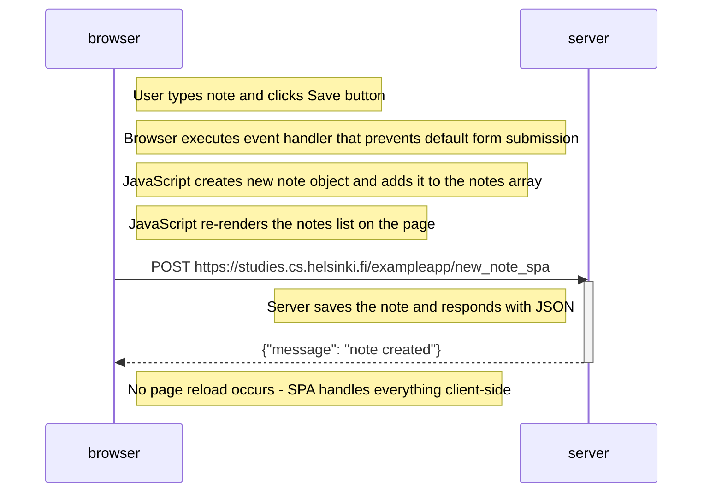

```mermaid
sequenceDiagram
    participant browser
    participant server

    Note right of browser: User types note and clicks Save button
    Note right of browser: Browser executes event handler that prevents default form submission
    Note right of browser: JavaScript creates new note object and adds it to the notes array
    Note right of browser: JavaScript re-renders the notes list on the page

    browser->>server: POST https://studies.cs.helsinki.fi/exampleapp/new_note_spa
    activate server
    Note left of server: Server saves the note and responds with JSON
    server-->>browser: {"message": "note created"}
    deactivate server

    Note right of browser: No page reload occurs - SPA handles everything client-side
```